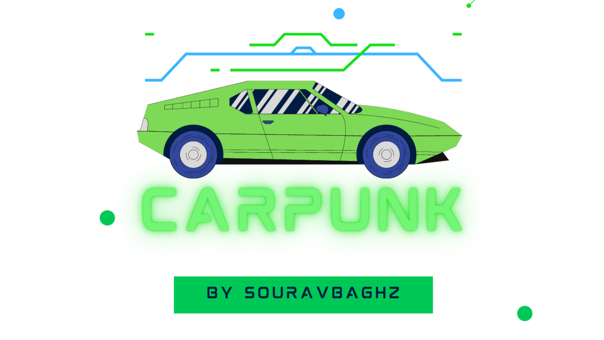
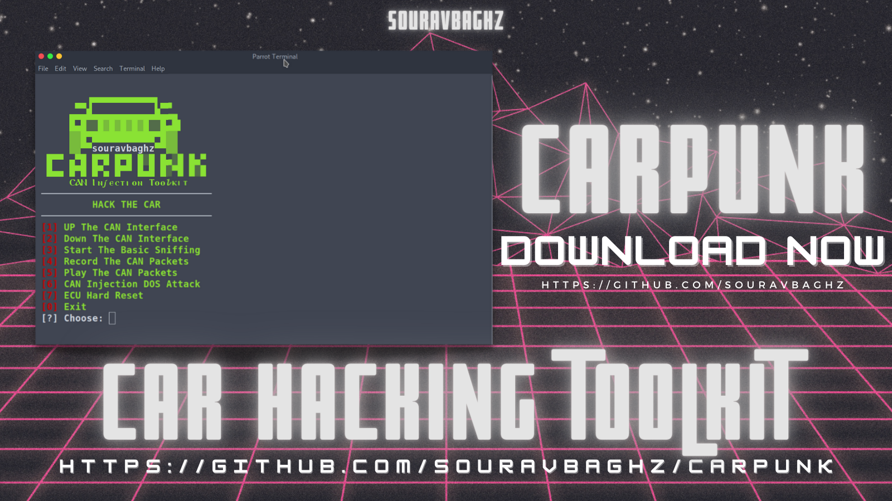

<p align="center">
  
</p>

<h1 align="center"> <b>Carpunk v2</b></h1>
<h2 align="center"><b>CAN Injection|Car Hacking Toolkit</b></h3> 

### What's New:

Carpunk is a CAN Injection Toolkit and an updated version of CANghost. Now it comes with some extra options like enable/disable the interface, basic sniffing, and the best part, it has some CAN Injection related vulnerabilities.

+ It works for both Simulation & Real cars.
+ Two more CAN injection attacks are added.
+ Tested on Ubuntu and Parrot OS.
***
#### Things to note before running Carpunk:
+ You have to load your canbus driver yourself, the script makes canbus interface up and down only.
+ Now you have to pass an argument for your canbus interface.
+ Your logs file will be named as carpunk1.log,carpunk2.log and so on if you're using in one shot. If you restart the script then it will create carpunk1.log again and your previously created carpunk1.log will be deleted.
+ Copy your all logs file somewhere else before starting the carpunk script.
+ I am not responsible for any damage to your vehicle and illegal activities with this toolkit. Use at your own risk. 


+ **Installation & Usage of CarPunk :**
 ```
 git clone https://github.com/souravbaghz/Carpunk
 cd Carpunk
 sudo bash carpunk.sh
 ```
 ***
 <p align="center">
  
</p>

+ [1] Up The CAN Interface     : Enable/UP the CAN Interface.
+ [2] Down The CAN Interface   : Make The CAN Interface Down.
+ [3] Start The Basic Sniffing : Start Sniffing Only(get terminal clear as soon as you stop it by ctrl+c).
+ [4] Record The CAN Packets   : Capture/Record The CAN Packets Into File(as carpunk1.log- name will be carpunk2.log,carpunk3.log,so on for multiple times).
+ [5] Play The CAN Packets     : Replay The CAN Packets Which You Captured Earlier(specify the log-file. e.g: carpunk1.log).
+ [6] CAN Injection DOS Attack : Perform DOS Attack Through CAN Injection.
+ [7] ECU Hard Reset           : ECU Hard Reset 
+ [0] Exit                     : To Exit The CarPunk Script.

 
 ***
 
 ### If You Do Love My Works Then You Can Buy Me A Coffee Now.
 <a href="https://www.buymeacoffee.com/souravbaghz" target="_blank"></a>
 
 ***
 
 
 [![!#/bin/bash](https://img.shields.io/badge/-%23!%2Fbin%2Fbash-1f425f.svg?style=for-the-badge&logo=image%2Fpng%3Bbase64%2CiVBORw0KGgoAAAANSUhEUgAAABgAAAAYCAYAAADgdz34AAAAGXRFWHRTb2Z0d2FyZQBBZG9iZSBJbWFnZVJlYWR5ccllPAAAAyZpVFh0WE1MOmNvbS5hZG9iZS54bXAAAAAAADw%2FeHBhY2tldCBiZWdpbj0i77u%2FIiBpZD0iVzVNME1wQ2VoaUh6cmVTek5UY3prYzlkIj8%2BIDx4OnhtcG1ldGEgeG1sbnM6eD0iYWRvYmU6bnM6bWV0YS8iIHg6eG1wdGs9IkFkb2JlIFhNUCBDb3JlIDUuNi1jMTExIDc5LjE1ODMyNSwgMjAxNS8wOS8xMC0wMToxMDoyMCAgICAgICAgIj4gPHJkZjpSREYgeG1sbnM6cmRmPSJodHRwOi8vd3d3LnczLm9yZy8xOTk5LzAyLzIyLXJkZi1zeW50YXgtbnMjIj4gPHJkZjpEZXNjcmlwdGlvbiByZGY6YWJvdXQ9IiIgeG1sbnM6eG1wPSJodHRwOi8vbnMuYWRvYmUuY29tL3hhcC8xLjAvIiB4bWxuczp4bXBNTT0iaHR0cDovL25zLmFkb2JlLmNvbS94YXAvMS4wL21tLyIgeG1sbnM6c3RSZWY9Imh0dHA6Ly9ucy5hZG9iZS5jb20veGFwLzEuMC9zVHlwZS9SZXNvdXJjZVJlZiMiIHhtcDpDcmVhdG9yVG9vbD0iQWRvYmUgUGhvdG9zaG9wIENDIDIwMTUgKFdpbmRvd3MpIiB4bXBNTTpJbnN0YW5jZUlEPSJ4bXAuaWlkOkE3MDg2QTAyQUZCMzExRTVBMkQxRDMzMkJDMUQ4RDk3IiB4bXBNTTpEb2N1bWVudElEPSJ4bXAuZGlkOkE3MDg2QTAzQUZCMzExRTVBMkQxRDMzMkJDMUQ4RDk3Ij4gPHhtcE1NOkRlcml2ZWRGcm9tIHN0UmVmOmluc3RhbmNlSUQ9InhtcC5paWQ6QTcwODZBMDBBRkIzMTFFNUEyRDFEMzMyQkMxRDhEOTciIHN0UmVmOmRvY3VtZW50SUQ9InhtcC5kaWQ6QTcwODZBMDFBRkIzMTFFNUEyRDFEMzMyQkMxRDhEOTciLz4gPC9yZGY6RGVzY3JpcHRpb24%2BIDwvcmRmOlJERj4gPC94OnhtcG1ldGE%2BIDw%2FeHBhY2tldCBlbmQ9InIiPz6lm45hAAADkklEQVR42qyVa0yTVxzGn7d9Wy03MS2ii8s%2BeokYNQSVhCzOjXZOFNF4jx%2BMRmPUMEUEqVG36jo2thizLSQSMd4N8ZoQ8RKjJtooaCpK6ZoCtRXKpRempbTv5ey83bhkAUphz8fznvP8znn%2B%2F3NeEEJgNBoRRSmz0ub%2FfuxEacBg%2FDmYtiCjgo5NG2mBXq%2BH5I1ogMRk9Zbd%2BQU2e1ML6VPLOyf5tvBQ8yT1lG10imxsABm7SLs898GTpyYynEzP60hO3trHDKvMigUwdeaceacqzp7nOI4n0SSIIjl36ao4Z356OV07fSQAk6xJ3XGg%2BLCr1d1OYlVHp4eUHPnerU79ZA%2F1kuv1JQMAg%2BE4O2P23EumF3VkvHprsZKMzKwbRUXFEyTvSIEmTVbrysp%2BWr8wfQHGK6WChVa3bKUmdWou%2BjpArdGkzZ41c1zG%2Fu5uGH4swzd561F%2BuhIT4%2BLnSuPsv9%2BJKIpjNr9dXYOyk7%2FBZrcjIT4eCnoKgedJP4BEqhG77E3NKP31FO7cfQA5K0dSYuLgz2TwCWJSOBzG6crzKK%2BohNfni%2Bx6OMUMMNe%2Fgf7ocbw0v0acKg6J8Ql0q%2BT%2FAXR5PNi5dz9c71upuQqCKFAD%2BYhrZLEAmpodaHO3Qy6TI3NhBpbrshGtOWKOSMYwYGQM8nJzoFJNxP2HjyIQho4PewK6hBktoDcUwtIln4PjOWzflQ%2Be5yl0yCCYgYikTclGlxadio%2BBQCSiW1UXoVGrKYwH4RgMrjU1HAB4vR6LzWYfFUCKxfS8Ftk5qxHoCUQAUkRJaSEokkV6Y%2F%2BJUOC4hn6A39NVXVBYeNP8piH6HeA4fPbpdBQV5KOx0QaL1YppX3Jgk0TwH2Vg6S3u%2BdB91%2B%2FpuNYPYFl5uP5V7ZqvsrX7jxqMXR6ff3gCQSTzFI0a1TX3wIs8ul%2Bq4HuWAAiM39vhOuR1O1fQ2gT%2F26Z8Z5vrl2OHi9OXZn995nLV9aFfS6UC9JeJPfuK0NBohWpCHMSAAsFe74WWP%2BvT25wtP9Bpob6uGqqyDnOtaeumjRu%2ByFu36VntK%2FPA5umTJeUtPWZSU9BCgud661odVp3DZtkc7AnYR33RRC708PrVi1larW7XwZIjLnd7R6SgSqWSNjU1B3F72pz5TZbXmX5vV81Yb7Lg7XT%2FUXriu8XLVqw6c6XqWnBKiiYU%2BMt3wWF7u7i91XlSEITwSAZ%2FCzAAHsJVbwXYFFEAAAAASUVORK5CYII%3D)](https://www.gnu.org/software/bash/)
 
 <br>

### 🤝 Connect with me
[](https://www.instagram.com/souravbaghz)
[](https://github.com/souravbaghz)
[](https://twitter.com/souravbaghz)
[](https://medium.com/@souravbaghz)

---
### Thanks To:
+ [@linux-can](https://github.com/linux-can) for [can-utils](https://github.com/linux-can/can-utils)
+ [@Craig Smith](https://github.com/zombieCraig) for [ICSim](https://github.com/zombieCraig/ICSim)
+ [@Jay Turla](https://github.com/shipcod3)
